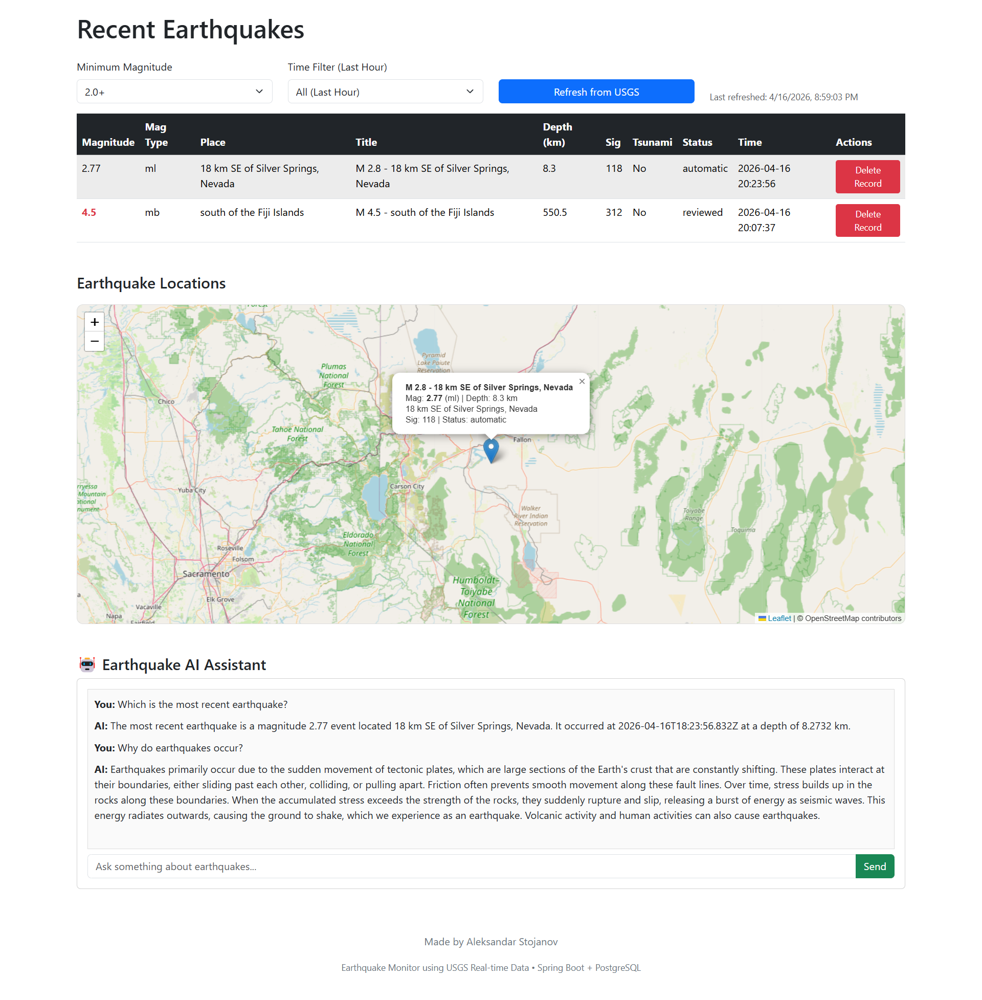

# 🌍 Earthquake Monitor Application

A full-stack web application for fetching, storing, filtering, and visualizing real-time earthquake data using the USGS public API.

Additionally, it includes an AI assistant powered by Google Gemini to answer natural language questions about earthquake data.
---

## 🚀 Features

- Fetch latest earthquake data from USGS API
- Store data in PostgreSQL database
- Filter earthquakes by:
    - Minimum magnitude
    - Time (e.g., last 10, 30 minutes)
- Delete specific earthquake records
- Display data in:
    - Table view
    - Interactive map (Leaflet)
- 🤖 AI Assistant (Gemini integration):
  - Ask natural language questions about earthquakes
  - AI responds based on stored earthquake data
  - Context-aware responses using latest dataset
- Exception handling for API and database errors
- Unit tests for service layer

---

## 🛠️ Technologies Used

### Backend
- Java
- Spring Boot
- Spring Data JPA
- PostgreSQL
- REST APIs
- Google Gemini API (AI integration)

### Frontend
- HTML, CSS
- Bootstrap
- JavaScript (Fetch API)
- Leaflet (map visualization)

---

## 🌐 External API

This project uses the USGS Earthquake API:

https://earthquake.usgs.gov/earthquakes/feed/v1.0/summary/all_hour.geojson

Google Gemini API

Used for AI-powered earthquake question answering.

---

## ⚙️ Setup Instructions

### 1. Clone the repository

```bash
git clone https://github.com/Aleksandar-Stojanov/earthquake-monitor.git
cd earthquake-app
```

---

### 2. Setup PostgreSQL Database

1. Install PostgreSQL
2. Create a database:

```sql
CREATE DATABASE earthquake_db;
```

---

### 3. Configure Environment Variables

Set the following environment variables:

#### Windows (PowerShell)
```bash
setx DB_USERNAME postgres
setx DB_PASSWORD your_password
setx GEMINI_API_KEY your_gemini_api_key
```

#### Mac/Linux
```bash
export DB_USERNAME=postgres
export DB_PASSWORD=your_password
export GEMINI_API_KEY=your_gemini_api_key
```

---

### 4. Configure application.properties

The application uses environment variables:

### Database

```properties
spring.datasource.username=${DB_USERNAME}
spring.datasource.password=${DB_PASSWORD}
```

### Gemini API
```properties
GEMINI_API_KEY=your_gemini_api_key
```
---

### 5. Run the Backend

Using IntelliJ:
- Open the project
- Run `EarthquakeAppApplication`

Or via terminal:

```bash
./mvnw spring-boot:run
```

---

### 6. Access the Application

Open your browser:

http://localhost:8080

---

## 🔄 API Endpoints

### Refresh earthquake data
```
POST /api/earthquakes/refresh
```

### Get earthquakes (with optional filters)
```
GET /api/earthquakes?minMag=2.0&after=timestamp
```

### Delete earthquake
```
DELETE /api/earthquakes/{id}
```

### Ask AI (Gemini)
```
POST /api/ai/ask
```
#### Request
```
{
  "question": "What was the strongest earthquake recently?"
}
```
#### Response
```
{
  "answer": "..."
}
```

---

## 🧪 Testing

Unit tests are implemented for the service layer using:
- JUnit 5
- Mockito

Tests cover:
- Successful API fetch and save
- API failure handling
- Invalid data handling
- Deletion of non-existing records
- Filtering logic
- AI prompt construction (Gemini service)
- Empty dataset handling in AI responses

---

## ⚠️ Exception Handling

The application handles:
- External API failures
- Invalid or missing data fields
- Database errors
- Resource not found scenarios
- Gemini API failures

---

## 📌 Assumptions

- Earthquake data is refreshed manually via API call
- Only earthquakes with valid magnitude are stored
- Default filtering is handled on the frontend
- AI responses are based only on the latest stored earthquake dataset

---
## ⭐ Bonus Features

- 🤖 Gemini AI earthquake assistant
- Interactive map visualization using Leaflet
- Real-time filtering (magnitude + time)

---


## 👨‍💻 Author

Aleksandar Stojanov

---

## 📧 Submission

This project was developed as part of:

**Interview Assignment 2026 – CODEIT**


